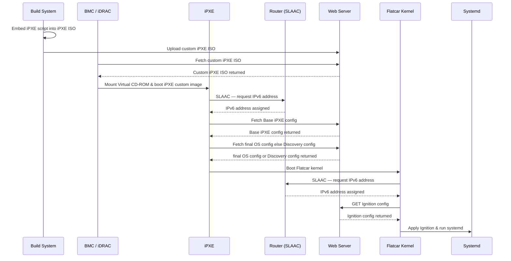

# BaseOS (Base Operating System)
Pre-Prod BaseOS for MaaS-like initiatives.

## Requirements
-  Flatcar Operating System - Immutable - Ephemeral - Stateless
-  UEFI Support
-  TPM (Trusted Platform Module) Support
-  Intel TXT (Trusted Execution Technology) Support
-  SLAAC IPv6 for Data Interfaces
-  No PXE
-  No DHCP

## Goals
-  Eliminate PXE and DHCP enabling a pathway to reduce server hardware and archaic troubleshooting between network teams, datacenter teams, deployment teams.
-  Eliminate IPv4 but still support if necessary.
-  Build a lightweight image that requires minimal environmental configuration to load quickly and do discovery and inventory tasks.
-  Enable a framework for container workloads to be layered in over time, to possibly include cabling checks, hardware checks, health checks, firmware updates, etc.
-  Enable base shell of an OS that can be accessible on the network with minimal configuration.
-  Create simple chainload-like bootstrap design flexible enough to handle an environment that is in infant stages of configuration or has been fully configured for production.
-  Proof of Concept "patching" using kexec on Flatcar with Ignition.  Upgrade Kernels without Reboot to reduce downtime.

## Process Flow

